  

<h1 align="center">Sergio Carey</h1>

  <strong>Informatics Engineer · Backend · Applied AI · Automation</strong> 
  Python · Django · PostgreSQL · Tauri · Rust

Arica, Chile · Building useful software for real-world problems

  
  
  

  

  
  
  

<a href="https://translate.google.com/translate?sl=en&tl=es&u=https%3A%2F%2Fgithub.com%2FSC-Sergio">🌐 Open with Google Translate</a>

---

## About / whoami

<table width="100%">
<tr>
<td width="68%" valign="top">

<pre>
sergio@github:~$ whoami

Name         Sergio Carey
Role         Informatics Engineer
Location     Arica, Chile
Focus        Backend · Applied AI · Automation
Building     Web · desktop · AI-powered software
</pre>

I build solutions for real-world problems by combining **backend engineering, databases, automation and applied artificial intelligence**. I am especially interested in turning concrete requirements into maintainable, useful software that can evolve over time.

</td>
<td width="32%" align="center" valign="middle">
  
</td>
</tr>
</table>

---

## Current Focus

<table width="100%">
<tr>
<th width="33%">🛠️ BUILDING</th>
<th width="33%">🧠 EXPLORING</th>
<th width="34%">📈 GROWING</th>
</tr>
<tr><td>FastLaundry</td><td>Applied AI</td><td>AI Engineering</td></tr>
<tr><td>Carey Assistant</td><td>LLMs · RAG</td><td>Cloud</td></tr>
<tr><td>Software tools</td><td>Automation</td><td>Data</td></tr>
</table>

---

## Tech Toolbox

  

<table width="100%">
<tr><th width="25%">Area</th><th>Core stack</th></tr>
<tr><td><strong>Backend</strong></td><td>Python · Django · PostgreSQL</td></tr>
<tr><td><strong>Frontend</strong></td><td>TypeScript · React · Next.js</td></tr>
<tr><td><strong>Desktop</strong></td><td>Tauri · Rust</td></tr>
<tr><td><strong>Mobile</strong></td><td>Kotlin · Android</td></tr>
<tr><td><strong>AI</strong></td><td>LLMs · RAG · Ollama · AI APIs</td></tr>
<tr><td><strong>Infrastructure</strong></td><td>Docker · Linux · Git/GitHub · Heroku · Vercel</td></tr>
</table>

<strong>🧰 View complete technology stack</strong>

 

| Category | Technologies & tools |
| --- | --- |
| **Backend** | Python, Django, Flask, REST APIs, business logic |
| **Data** | PostgreSQL, MySQL, SQLite, Jupyter Notebook |
| **Frontend** | JavaScript, TypeScript, React, Next.js, Vue, HTML, CSS, Tailwind CSS |
| **Desktop / Mobile** | Tauri, Rust, Kotlin, Android |
| **AI & automation** | Ollama, LLMs, assistants, prompting, RAG, automated workflows |
| **Infrastructure** | Docker, Linux, Git/GitHub, Heroku, Vercel |
| **Integrations** | Twilio, external APIs, RSS/Atom and web services |

---

## Featured Projects

<table width="100%">
<tr>
<td width="50%" valign="top">
<h3>🧺 FastLaundry</h3>

<strong>Production management system for a real laundry business</strong>, covering customers, orders, cash management, payments, service tickets, deliveries and daily operations.

<code>Python 3.12</code> · <code>Django 5.2</code> · <code>PostgreSQL</code>

 

</td>
<td width="50%" valign="top">
<h3>🤖 Carey Assistant</h3>

<strong>Windows desktop assistant</strong> focused on local AI, automation and productivity.

<code>Tauri</code> · <code>React</code> · <code>TypeScript</code> · <code>Rust</code> · <code>Ollama</code>

</td>
</tr>
<tr>
<td width="50%" valign="top">
<h3>🌐 Portfolio v2</h3>

<strong>Modern professional portfolio</strong> with an interactive frontend, technology-focused identity and lightweight 3D experience.

<code>Next.js</code> · <code>TypeScript</code> · <code>Tailwind CSS</code> · <code>Three.js</code>

 

</td>
<td width="50%" valign="top">
<h3>🚀 Falcon 9 Landing Prediction</h3>

<strong>Data science and machine learning project</strong> focused on Falcon 9 landing analysis and prediction.

<code>Python</code> · <code>Jupyter</code> · <code>Data Science</code> · <code>Machine Learning</code>

</td>
</tr>
</table>

<strong>📂 View more projects and repositories</strong>

 

- 🏟️ [CanchaClara](https://github.com/SC-Sergio/canchaclara) — sports field booking and management platform.
- 🔐 [Challenge Encriptador](https://github.com/SC-Sergio/challenge-encriptador)
- ☕ [Challenge ForoHub](https://github.com/SC-Sergio/ChallengeForoHub)
- 📚 [Literalura](https://github.com/SC-Sergio/Challengeliteralura)
- 💱 [Currency Converter](https://github.com/SC-Sergio/ChallengeConversordeMonedasAluraLatam)
- 📊 [Data Science Ecosystem](https://github.com/SC-Sergio/DataScienceEcosystem)
- 🧪 [All public repositories](https://github.com/SC-Sergio?tab=repositories)

---

## GitHub Activity

  <picture>
    <source media="(prefers-color-scheme: dark)" srcset="./profile-assets/contributions.dark.svg" />
    <source media="(prefers-color-scheme: light)" srcset="./profile-assets/contributions.light.svg" />
    
  </picture>

SVG generated from the GitHub API by GitHub Actions and stored in this repository.

---

## Education & Certifications

<table width="100%">
<tr><th>Education / certification</th><th width="12%">Year</th></tr>
<tr><td>☁️ <strong>Oracle Cloud Infrastructure 2026 Certified AI Foundations Associate</strong></td><td align="center"><strong>2026</strong></td></tr>
<tr><td>🛡️ <strong>Cisco Networking Academy · Cybersecurity Foundations</strong></td><td align="center"><strong>2026</strong></td></tr>
<tr><td>🎓 <strong>Informatics Engineering · INACAP</strong></td><td align="center"><strong>2024</strong></td></tr>
<tr><td>📊 <strong>IBM Data Science · Coursera</strong></td><td align="center"><strong>2024</strong></td></tr>
</table>

  

<strong>🎓 View education and certifications in detail</strong>

 

### ☁️ Oracle Cloud Infrastructure 2026 Certified AI Foundations Associate

**Exam:** 1Z0-1122-26 · **Passed on September 2, 2026.**

Certification covering **artificial intelligence, machine learning and generative AI foundations in Oracle Cloud Infrastructure**.

### 🛡️ Cisco Networking Academy · Cybersecurity Foundations

Completed **Fundamentos de Ciberseguridad - Egresados INACAP** on **August 14, 2026**, earning a completion certificate and digital credential.

### 🎓 Informatics Engineering · INACAP

**Professional degree obtained on August 16, 2024.** The official INACAP certificate was issued on **September 24, 2024**.

Academic background in software development, databases, applied artificial intelligence, data and information systems.

### 📊 IBM Data Science · Coursera

Intensive **IBM Data Science learning path on Coursera**, with verified course completions between **June 27 and July 4, 2024**. Topics include Python, SQL, data analysis and visualization, machine learning, generative AI and a final SpaceX applied project.

<strong>View completed courses</strong>

- Python for Data Science, AI & Development
- What is Data Science?
- Tools for Data Science
- Data Science Methodology
- Python Project for Data Science
- Databases and SQL for Data Science with Python
- Data Analysis with Python
- Data Visualization with Python
- Machine Learning with Python
- Generative AI: Elevate Your Data Science Career
- Applied Data Science Capstone
- Data Scientist Career Guide and Interview Preparation

---

## How I Build Software

<strong>UNDERSTAND → DESIGN → BUILD → VALIDATE → DEPLOY → IMPROVE</strong>

1. **UNDERSTAND** — Understand the real problem and workflow before implementation.
2. **DESIGN** — Prefer a simple, maintainable and verifiable solution.
3. **BUILD** — Implement incrementally with clear boundaries.
4. **VALIDATE** — Test behavior, data integrity and regressions.
5. **DEPLOY** — Protect the separation between development and production.
6. **IMPROVE** — Document decisions and keep evolving the product.

---

## Beyond Code

Beyond software development, I enjoy **video games, anime, artificial intelligence and technology**. They are part of this profile's visual identity while the main focus remains technical and professional work.

  

---

## Contribution Journey

  <picture>
    <source media="(prefers-color-scheme: dark)" srcset="https://raw.githubusercontent.com/SC-Sergio/SC-Sergio/output/github-contribution-grid-snake-dark.svg" />
    <source media="(prefers-color-scheme: light)" srcset="https://raw.githubusercontent.com/SC-Sergio/SC-Sergio/output/github-contribution-grid-snake.svg" />
    
  </picture>

---

## Contact

  
  
  

<strong>Thanks for visiting my profile.</strong>

