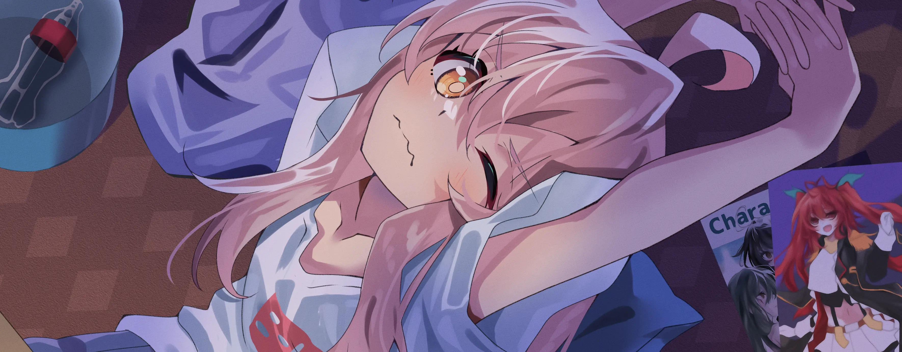

<!-- Animación superior ligera estilo tech/anime -->

  

### ¡Hola! 👋 Soy Sergio Carey

**Ingeniero Informático | Python | Inteligencia Artificial | Chatbots | Automatización**

Soy un desarrollador apasionado por crear soluciones tecnológicas útiles, especialmente usando **Python**, **IA aplicada**, **Flask**, **APIs** y automatización. Me interesa construir proyectos que mezclen desarrollo de software, experiencia de usuario y herramientas inteligentes que ayuden en problemas reales.

---

## **☕ Sobre mí**

Soy **Ingeniero Informático titulado en INACAP**, con interés fuerte en el desarrollo de software, inteligencia artificial y automatización de procesos. Me gusta crear proyectos prácticos, especialmente asistentes, chatbots, plataformas web y herramientas que puedan ser usadas por personas reales.

Mis hobbies incluyen jugar videojuegos, ver anime, investigar nuevas tecnologías y experimentar con herramientas de IA para programación, diseño, automatización y creación de contenido.

  

---

## **💻 Experiencia y enfoque**

Tengo experiencia desarrollando soluciones con **Python**, **Flask**, **Twilio**, integración con **APIs externas**, automatización de flujos conversacionales y mejora de experiencia de usuario en chatbots de WhatsApp.

Me interesa especialmente el desarrollo de asistentes inteligentes, sistemas web funcionales, herramientas de apoyo educativo y plataformas que simplifiquen procesos cotidianos.

| Área                    | Enfoque                                                         |
| ----------------------- | --------------------------------------------------------------- |
| Desarrollo Backend      | Python, Flask, Django, APIs                                     |
| Inteligencia Artificial | Asistentes, automatización, prompts, integración con modelos IA |
| Chatbots                | WhatsApp, Twilio, menús conversacionales, UX conversacional     |
| Desarrollo Web          | HTML, CSS, JavaScript, Vue, interfaces simples y funcionales    |
| Despliegue              | Docker, servidores Linux, pruebas y mejoras continuas           |

 

---

## **🧰 Tecnologías y herramientas**

---

## 🚀 Proyectos Destacados

### 🚗 Asistente para aprobar el examen de conducir Clase B

Proyecto orientado a ayudar a usuarios a practicar para el examen teórico de conducción en Chile mediante un bot conversacional de WhatsApp.

**Tecnologías utilizadas:**

**Características principales:**

* Preguntas aleatorias para practicar el examen.
* Sistema de puntos, niveles y ranking.
* Perfil de usuario con logros.
* Práctica de respuestas incorrectas.
* Flujo conversacional mediante WhatsApp.
* Enfoque en experiencia de usuario simple y directa.

**Estado:** Proyecto en desarrollo y mejora continua.

---

### 🏟️ [CanchaClara](https://github.com/SC-Sergio/canchaclara)

Plataforma para la gestión y reserva de canchas deportivas, pensada para optimizar el uso de instalaciones deportivas y facilitar el proceso de reserva para usuarios y administradores.

**Objetivo del proyecto:**

Crear una solución web que permita reservar canchas, gestionar horarios, administrar disponibilidad y mejorar la organización de espacios deportivos.

**Tecnologías relacionadas:**

---

### 🔐 [Challenge Encriptador](https://github.com/SC-Sergio/challenge-encriptador)

Aplicación web para encriptar y desencriptar textos de forma simple, desarrollada como parte de un desafío de programación.

**Características:**

* Encriptación y desencriptación de texto.
* Interfaz simple y fácil de usar.
* Validación de entrada.
* Funcionalidad de copiar resultado.

**Tecnologías utilizadas:**

---

### 🧺 FASTLAUNDRY

Sistema de gestión para lavandería, enfocado en pedidos, caja, pagos, guías y control operativo.

**Áreas trabajadas:**

* Gestión de pedidos.
* Registro de pagos y abonos.
* Control de caja.
* Guías y procesos internos.
* Mejoras visuales y funcionales en formularios.

**Tecnologías relacionadas:**

---

### 🌎 Alerta Sísmica Arica

Aplicación orientada a consultar información sísmica relevante, con foco en eventos cercanos a Arica, Chile.

**Idea principal:**

Construir una app ligera, clara y fácil de usar para visualizar sismos recientes, fuentes de datos confiables y eventos cercanos a una zona definida.

**Tecnologías relacionadas:**

---

## 🧠 Actualmente aprendiendo y mejorando

* Desarrollo de asistentes inteligentes con IA.
* Automatización de tareas con Python.
* Integración de APIs en proyectos reales.
* Desarrollo web con backend robusto.
* Mejora de interfaces y experiencia de usuario.
* Buenas prácticas para proyectos desplegables.

  

---

## 🎮 Un poco más personal

Además de la programación, me gusta jugar videojuegos, ver anime y explorar herramientas nuevas. Me interesa mucho la mezcla entre tecnología, creatividad e inteligencia artificial.

También me gusta experimentar con ideas de asistentes virtuales, diseño de interfaces, automatización y herramientas que puedan ayudar a personas en tareas reales.

  

---

## 🎧 Lo que más escucho

  

---

## **📫 Contacto**

**Si quieres contactarme, puedes escribirme o revisar mis perfiles en los siguientes enlaces:**

 

**Gracias por visitar mi perfil 👋**

